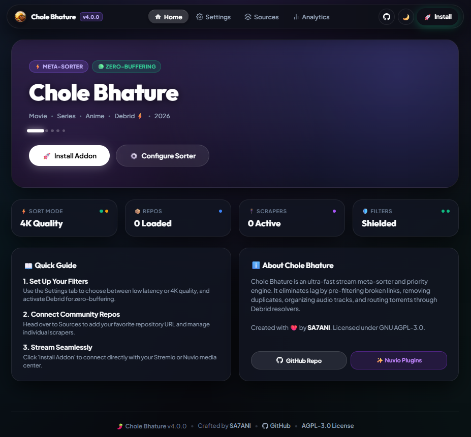

<div align="center">

  

  # Chole Bhature
  ### High-Performance Stream Meta-Sorter & Priority Engine for Nuvio & Stremio

  [](https://github.com/SA7ANI/chole-bhature)
  [](https://github.com/SA7ANI/chole-bhature)
  [](LICENSE)
  [](https://github.com/SA7ANI)

  <br>

  

</div>

---

## 🌟 Overview

**Chole Bhature** is a high-performance stream meta-sorter and priority engine designed for **Nuvio** and **Stremio**. 

Instead of waiting through buffering wheels or clicking broken links, Chole Bhature intercepts stream requests from **120+ scrapers across multiple repositories**, concurrently **live-probes every stream for latency and health**, eliminates duplicates, and serves a cleanly formatted, deterministic stream list tailored to your exact audio, quality, and speed preferences.

---

## ✨ Key Features

| Feature | Description |
| :--- | :--- |
| ⚡ **Real-Time Latency Probing** | Concurrently tests HTTP/HLS streams via lightweight `HEAD`/`Range` requests. Dynamically tags links with `🟢 FAST (<800ms)`, `🟡 SLOW (≥800ms)`, or `🔴 DEAD`. |
| 💎 **Debrid Premium Integration** | Add your Real-Debrid or AllDebrid API key to instantly unrestrict torrent links. Replaces magnet URLs with high-speed direct links using a zero-buffering server-side resolver and tags them with `⚡ [RD+]` or `⚡ [AD+]`. |
| 🛑 **Provider Quarantine System** | Automatically isolates failing or offline scrapers for 30 minutes after 3 consecutive failures to eliminate 26-second delay penalties. |
| 🎛️ **Granular Scraper Toggles** | Manage scrapers individually with the new Sources tab. Instantly bulk enable/disable hundreds of providers at once. |
| 🎬 **Strict 4K UHD Hierarchy** | Strict resolution-first ordering (`4K UHD` > `1080p FHD` > `720p HD` > `480p SD`). Lower resolutions will never leapfrog 4K content in Quality mode. |
| 🚫 **Auto-Hide CAM & Theater Rips** | Automatically filters out blurry theater recordings (`CAM`, `HDCAM`, `TeleSync`, `TC`, and `Screeners`). |
| 🧲 **Smart P2P Torrent Health** | Accurately maps torrent swarm seeders to health badges (`🟢 20+ Healthy`, `🟡 5–19 Moderate`, `🔴 1–4 Buffering Risk`) to prevent stalled playback. |
| 🌐 **Regional & Multi-Audio Priority** | Float preferred languages (`Hindi`, `Tamil`, `Telugu`, `Malayalam`, `Dual-Audio`, `Anime/Jap`, etc.) directly to the top of your stream list. |
| 🧩 **Multi-Source Deduplication** | Merges identical streams found across different providers into unified entries with multi-source badges (e.g. `CinemaHD + Torrentio`) and maximum seeder counts. |
| 🛡️ **DNS-over-HTTPS (DoH)** | Built-in DoH engine with Cloudflare, Google, AdGuard, and Quad9 resolvers to bypass ISP-level domain blocks with zero latency impact. |
| 📊 **Live Analytics Dashboard** | Real-time web UI dashboard that displays millisecond-accurate ping latencies, success rates, and health statuses for all scrapers. |
| 🚀 **Stale-While-Revalidate Caching** | Advanced caching system returns streams instantly from stale cache while silently re-testing scrapers in the background for blazing fast subsequent loads. |
| ☁️ **Instant Cloud Sync** | Save your configuration once on the web UI and changes sync live to your player—no need to reinstall the addon! |
| 🏷️ **Rich Metadata Badges** | Automatically extracts and displays badges for `HDR10`, `Dolby Vision`, `IMAX`, `REMUX`, `HEVC`, `Dolby Atmos`, `5.1/7.1 Audio`, and file size. |

---

## 🎛️ Intelligent Sorting Modes

Choose how your streams are ranked in the configuration dashboard:

1. **⚡ Speed & Low Latency First (Default)**: Prioritizes the fastest responding streams with the lowest millisecond ping first.
2. **🎬 Maximum Quality (4K UHD First)**: Strict resolution tiering (`2160p` > `1080p` > `720p`), sorted by ping speed and release quality (`REMUX` > `BluRay` > `WEB-DL`) within each tier.
3. **⚖️ Smart Balanced**: High-efficiency matrix prioritizing `4K Fast` > `1080p Fast` > `4K Slow` > `1080p Slow` > `720p Fast`.
4. **🧲 P2P Seeders First**: Ranks torrent streams by highest active seeder count and overall swarm health.

---

## 🚀 Getting Started


### 💻 Running Locally

```bash
# 1. Clone the repository
git clone https://github.com/your-username/chole-bhature.git
cd chole-bhature

# 2. Install dependencies
npm install

# 3. Start the server
npm start
```

Open [http://localhost:7000/configure](http://localhost:7000/configure) in your browser.

---


## ⚖️ Attribution & Anti-Leech Policy

This project is free and open-source under the **GNU Affero General Public License v3.0 (AGPL-3.0)**.

If you fork, self-host, or redistribute any portion of this software (including modified versions running over a network/cloud service like Vercel, Render, HuggingFace, or Docker):
1. **Mandatory Credit**: You **MUST** retain visible attribution to the original author (**SA7ANI**) and link back to the official repository: [`https://github.com/SA7ANI/chole-bhature`](https://github.com/SA7ANI/chole-bhature).
2. **No De-Branding**: Stripping author credits, repository links, or branding from the UI, API responses, terminal logs, or manifest without explicit permission is a direct violation of the GNU AGPLv3 license terms.
3. **Open Source Requirement**: Any network-accessible deployment running modified code must provide the full corresponding source code under the same AGPL-3.0 license.

---

## 📝 License & Copyright

Copyright (C) 2026 **SA7ANI** (<https://github.com/SA7ANI/chole-bhature>)

Licensed under the **GNU Affero General Public License v3.0 (AGPL-3.0)**. See the [LICENSE](LICENSE) and [NOTICE](NOTICE) files for full legal terms.
